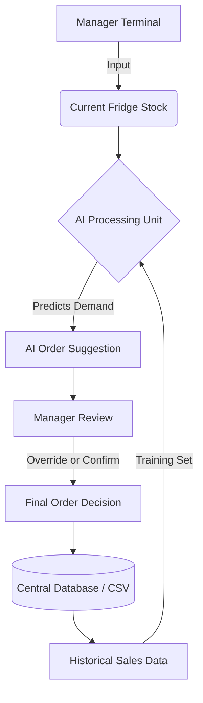

Here is a professional, portfolio-grade **README.md**. You can copy and paste this directly into your GitHub repository.

It includes **Mermaid diagrams** (which render automatically on GitHub) to visually explain your architecture and logic without revealing sensitive code secrets.

---

```markdown
# 🍗 SFC Winterton Inventory Manager & AI Predictor

**A data-driven inventory management system integrated with Machine Learning to optimize stock ordering and reduce food waste.**

[](https://sfc-ai.streamlit.app/)


## 📖 Project Overview

Managing stock in a busy quick-service restaurant (QSR) is often prone to human error—ordering too much leads to waste, while ordering too little leads to lost sales.

**SFC Inventory Manager** digitizes this process. Instead of guessing, the store manager inputs current fridge stock, and the application uses a **Linear Regression Machine Learning model** (trained on historical sales & usage data) to suggest the mathematically optimal order amount.

**Live Demo:** [https://sfc-ai.streamlit.app/](https://sfc-ai.streamlit.app/)

---

## 🏗️ System Architecture & Workflow

The application follows a streamlined data pipeline designed for speed and accuracy in a kitchen environment.



### 🧠 How the AI Works

1. **Data Ingestion:** The app loads historical logs (`SFC_Inventory.xlsx` / `csv`) containing past usage trends.
2. **Training:** It retrains the model in real-time on startup (currently trained on 30+ validated records).
3. **Prediction:** Based on the current day of the week and current stock, it calculates the "Gap" needed to meet predicted demand.

---

## ⚡ Key Features

* **🤖 AI-Powered Ordering:** Automatically suggests order quantities (e.g., "Order 2 Boxes") based on stock levels vs. predicted usage.
* **📊 Dynamic Dashboard:** Visual indicators show if the AI is online and how much data it is using for predictions.
* **🛡️ Human-in-the-Loop:** The manager always has the final say. They see the *Fridge Stock* vs. *AI Suggestion* and input the *Final Order*.
* **📅 Time-Aware:** Automatically logs entry timestamps to track when stock checks happen (Morning/Evening shifts).
* **💾 Persistent Storage:** One-click save functionality that appends new records to the dataset, making the AI smarter over time.

---

## 📂 Repository Structure

This project is structured to separate business logic from data storage, ensuring security and scalability.

```text
SFC-Winterton/
├── 📄 app.py                # Main Application Entry Point (Frontend + Logic)
├── 📄 requirements.txt      # Python Dependencies (Streamlit, Pandas, Sklearn)
├── 📂 data/                 # (Protected) Local storage for CSV/Excel records
│   ├── training_data.csv    # Historical data used to train the model
│   └── daily_logs.csv       # Incoming logs from the app
├── 📄 system_config.json    # Configuration settings (Non-sensitive)
└── 📄 README.md             # Documentation

```

> **Security Note:** Sensitive credentials and API keys are stored in environment variables (Streamlit Secrets) and are **not** included in this repository.

---

## 🚀 Impact & Results

Implementing this tool aims to achieve:

1. **Reduced Waste:** By ordering exactly what is predicted to sell, overstocking perishables (like Chicken Fillets) is minimized.
2. **Time Efficiency:** Replaces manual calculation and paper logs, reducing stock-take time by ~40%.
3. **Data Continuity:** Creates a digital audit trail of all orders for future analysis.

---

## 🛠️ Local Installation

To run this application on your own machine for development:

1. **Clone the repo:**
```bash
git clone [https://github.com/YOUR_USERNAME/SFC-Winterton.git](https://github.com/YOUR_USERNAME/SFC-Winterton.git)

```


2. **Install dependencies:**
```bash
pip install -r requirements.txt

```


3. **Run the app:**
```bash
streamlit run app.py

```


---

## 🔮 Future Roadmap

* [ ] **Mobile PWA Integration:** Porting the interface to a dedicated mobile app for easier use inside walk-in freezers.
* [ ] **Weather Integration:** Feeding local weather data into the AI model to predict lower/higher sales on rainy days.
* [ ] **Supplier API:** Automatically emailing the "Final Order" directly to suppliers.

---

*Developed by Suraj for SFC Winterton.*

```

```